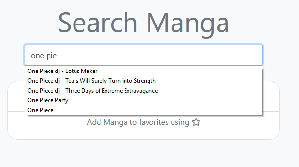

# Manga Viewer

### Application created with Flask for reading favorite [**Manga**](https://en.wikipedia.org/wiki/Manga)


### ___Online___: [deployed to Heroku](https://manga-viewer.herokuapp.com/ "Heroku Manga-Viewer")

To access application, it is required to login. Register for a new account or use credentials below:

>username: testing\
>password: testing
---
## Technologies
Project is created with:
* Python version: 3.6.5
* Flask version: 0.12.2
* SQLAlchemy version: 1.2.6
* MySQL database on private hosting
* Bootstrap 4
* JS library for fetching data: Axios
* App uses external API for pulling data about mangas and chapter images: [Manga Eden API](https://www.mangaeden.com/api "API")
---
## Overview

* Search bars are displaying suggestions dynamically while typing title of Manga

  

* Manga Info Page, showing information, chapters and their release date

    

* **Add to favorites** function, makes Manga easy accessed from main page

    

* Main Page with favorite Manga

    

* View Chapter pages one below another 

    

---
## Setup
To run the app on locally, it would be needed to attach own SQL database. Required to change `config.py` file in root directory.

`config.py`
```
SQLALCHEMY_DATABASE_URI = '<URI To Database>'
```

Install all dependecies:
```
$ pip install -r requirements.txt
```
Before starting application, connect to database as above by setting URI and in root direcotry run:
```
$ python setup_tables.py
```

Then when application run first time, will fetch all Manga titles from API and save them into database.
```
$ python application.py
```


